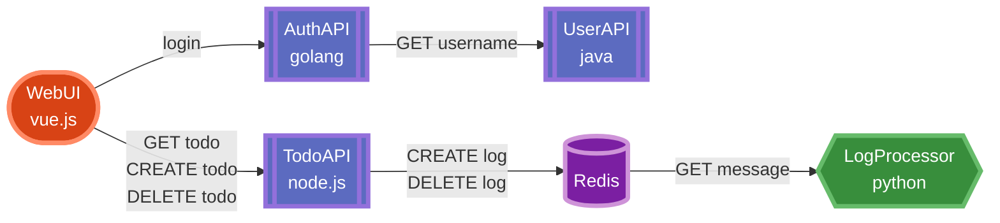

# Microservices Example Application

This is an example of web application comprising of several microservices communicating to each other. Each microservice is written in a different language to demonstrate the key tenant of microservices: developer flexibility.

The application itseld is a simple TODO list that additionally authenticates user logins.

## Microservices

1. [Web UI](./web-ui/README) provides a login page. This is a Javascript application created with [Vue.js](http://vuejs.org)
2. [Auth API](./auth-api/README) is written in [Go](https://go.dev/) and provides authorization functionality. It generates JWT tokens to be used with other APIs.
3. [Todo API](./todo-api/README) is written with [Node.js](https://nodejs.org/), provides CRUD functionality for user's `todo` records. Also, it logs `create` and `delete` operations to Redis queue, so they can be later processed by [Log Message Processor](/log-message-processor/README).
4. [User API](./user-api/README) is a Spring Boot project written in [Java](https://www.java.com/) that provides user profiles. It does not provide full CRUD, but just returns either a single user or all users.
5. [Log Processor](./log-processor/README) is a very short queue processor written in [Python](https://www.python.org/). It's only purpose is to read messages from Redis queue and print them to stdout
6. [Zipkin](https://zipkin.io). Optional 3rd party system that aggregates traces produced by other components.

## Service Diagram

Here are the components that comprose this microservice application.



## Running

### Docker Compose

The easiest way is to use `docker-compose`:

```
docker-compose up -d
```
* Web UI will be running on: http://127.0.0.1:8080 
* [Zipkin](https://zipkin.io) will be running on: http://127.0.0.1:9411

### Kubernetes

* manifests are located in `k8s/manifests`
* Helm chart is located in `k8s/helm`


## License

MIT

## Original

This application was cloned from the original repo by [elgris](https://github.com/elgris/microservice-app-example).
